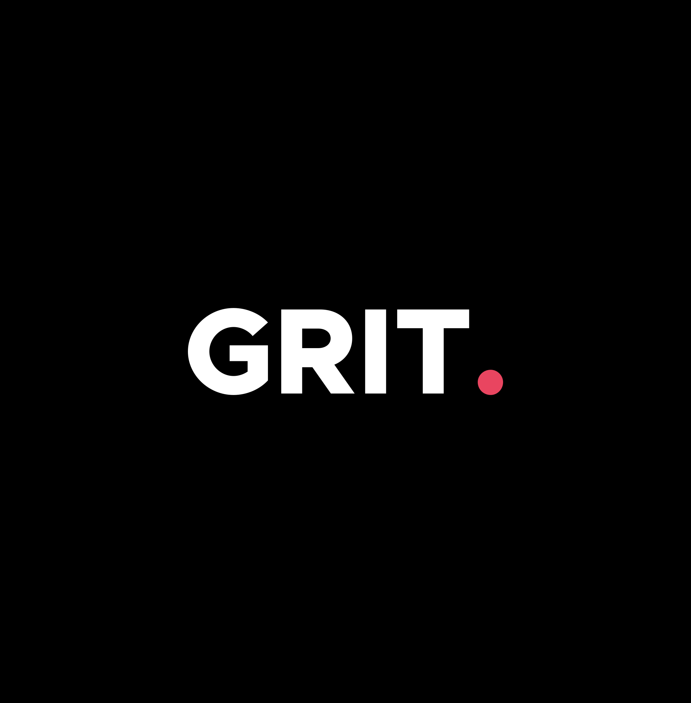
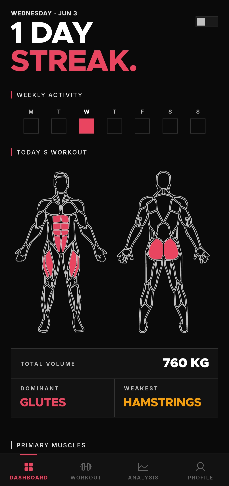
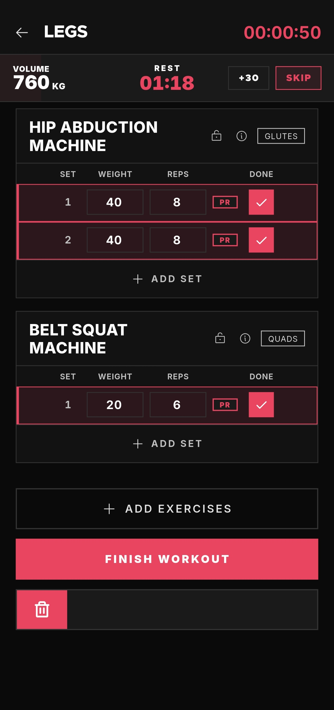
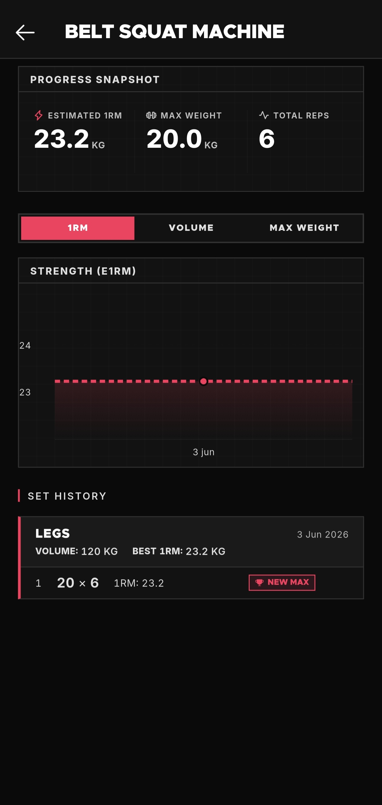

<p align="center">
  
</p>

# 🏋️‍♂️ Grit — Offline Workout Tracker

[](https://www.gnu.org/licenses/gpl-3.0.html)
[](https://flutter.dev)
[](#)
[](#)
[](https://github.com/ellerbrock/open-source-badges/)
[](#)

Most workout apps want you to engage with them. **Grit just wants you to lift and track.**

Open the app, log your workout, close it. That's the whole idea. No account required, no data leaves your phone, no streaks, no badges, and no daily reminders. Just a clean, high-performance log of everything you've lifted.

---

## 📱 Screenshots

<p align="center">
  
  
  
</p>

---

## ✨ Features

- **⚡ Fast Logging**: Record your sets, reps, and weights in seconds with a high-density, zero-friction interface.
- **🔄 Unlimited Routines**: Create, customize, and save as many custom training routines as you need.
- **📚 Exercise Library**: Pre-loaded with the most commonly used exercises and lifts to start logging instantly.
- **📊 Metric Tracking**: Monitor your bodyweight and body measurements over time with clean visual charts.
- **🔥 Personal Records**: Automatically tracks and highlights your personal records (PRs) for every lift.
- **📅 Weekly Analytics**: See exactly what you've accomplished this week at a glance.
- **🔒 Absolute Privacy**: Operates 100% offline. All personal biometrics and logs are stored strictly on-device in a local SQLite database.

---

## 🛠️ Technical Stack

- **Framework**: Flutter (Dart)
- **Database**: SQLite (via `sqflite`) for robust, local relational data storage.
- **State Management**: Flutter Riverpod
- **Animation**: `flutter_animate` for responsive micro-interactions.
- **Icons**: Phosphor Icons

---

## 🚀 Getting Started

To build and run the application locally:

### Prerequisites

- [Flutter SDK](https://docs.flutter.dev/get-started/install) (latest stable version)
- Android Studio / VS Code with Flutter extensions
- Android SDK (for Android build)

### Installation & Run

1. **Clone the repository:**

   ```bash
   git clone https://github.com/8sujan6/GRIT.git
   cd GRIT
   ```
2. **Fetch dependencies:**

   ```bash
   flutter pub get
   ```
3. **Run the app on a connected device:**

   ```bash
   flutter run
   ```
4. **Build the release APK:**

   ```bash
   flutter build apk --release
   ```

---

## 🤝 Sponsor Development

If Grit helps you build strength and you'd like to support its ongoing, active development, consider sponsoring the project on [GitHub Sponsors](https://github.com/sponsors/8sujan6).

---

## 📦 Credits & Dependencies

- **[muscle_selector](https://pub.dev/packages/muscle_selector)** by EmilCes — Providing the interactive human body SVG documents for muscle selection.
- **[phosphor_flutter](https://pub.dev/packages/phosphor_flutter)** — Crisp and modern minimalist icon family.

---

## 📄 License

This project is licensed under the **GNU General Public License v3.0** — see the [LICENSE](LICENSE) file for details.
