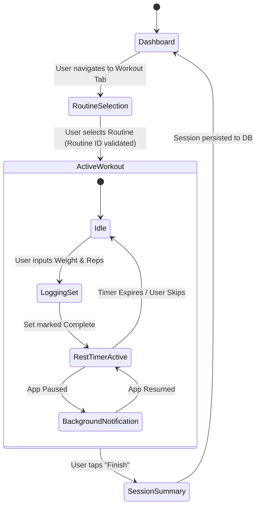
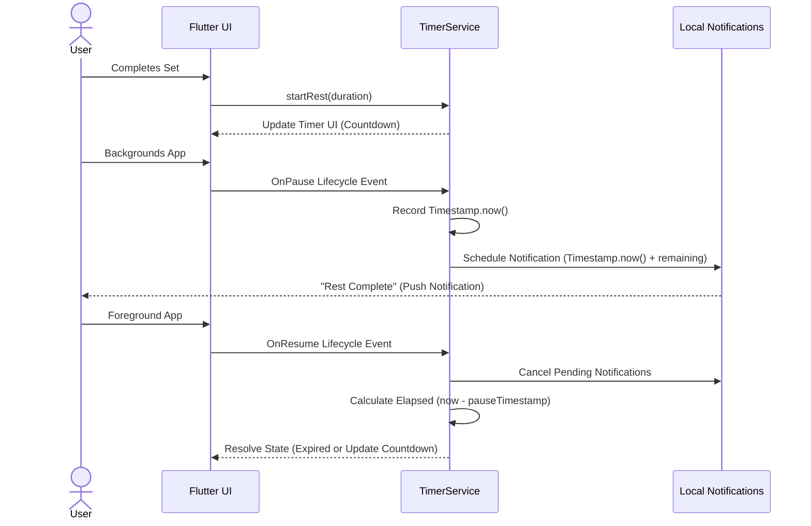

# GRIT - Technical Flow & Logic

## 1. Active Workout Lifecycle
The following flowchart illustrates the strict, routine-bound state machine for an active session.



## 2. Rest Timer & Background Notification Sequence
Because Flutter execution pauses when the app is backgrounded, the timer logic relies on calculating time deltas and scheduling OS-level notifications.



## 3. Muscle Volume Radar Chart Calculation Pipeline
Data flows from the local SQLite database to the chart UI via a highly optimized Riverpod provider.

```mermaid
graph TD
    A[User Adjusts Period Toggle: 4W/8W/12W] --> B[Invalidate muscleVolumeProvider]
    B --> C[Query SQLite: SELECT sets WHERE date >= Period AND is_warmup = 0]
    C --> D[Join EXERCISE_MUSCLE_TAGS]
    D --> E[Aggregate: SUM(weight * reps) GROUP BY muscle_name]
    E --> F[Convert to User Preferred Unit KG/LBS]
    F --> G[Sort DESC & Limit to Top 10 Muscles]
    G --> H[Calculate Axis Max: Round Up to nearest 1000]
    H --> I[Render fl_chart RadarChart]
```
