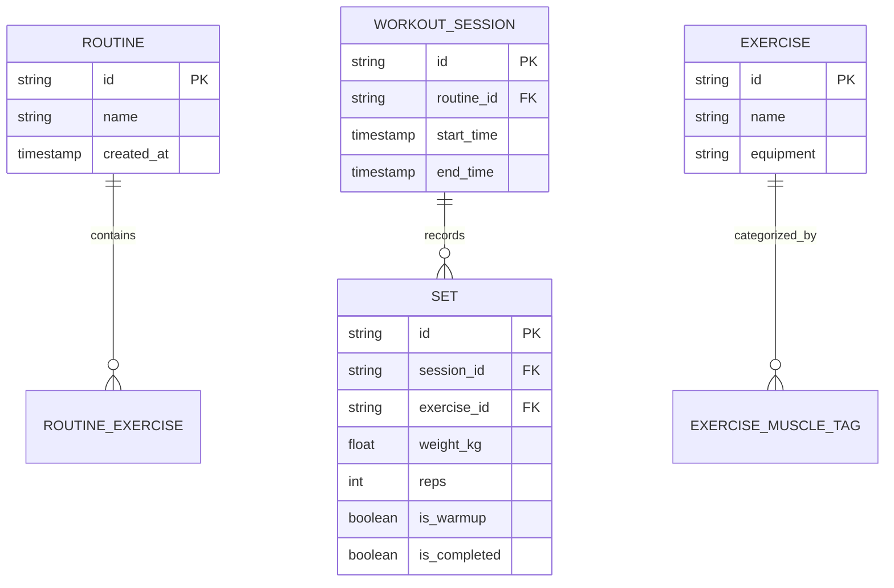

# GRIT - Technical Requirements Document (TRD)

## 1. System Architecture
GRIT utilizes a monolithic, local-first architecture built on the Flutter framework. State is managed via Riverpod, ensuring unidirectional data flow and strict separation of concerns between the UI, business logic, and local data persistence layers.

## 2. Technology Stack
- **Frontend Framework:** Flutter (Dart)
- **State Management:** Riverpod (Provider pattern)
- **Local Database:** SQLite (via sqflite) / Hive for key-value pair caching.
- **Routing:** GoRouter (declarative routing)
- **Background Services:** `flutter_local_notifications` for rest timer completion events.

## 3. Database Schema (Entity-Relationship)

## 4. State Management (Provider Tree)
- `workoutProvider`: Manages the active session. Subscribes to the local database to optimistically update set completions.
- `timerProvider`: A globally accessible singleton state managing the active rest interval, elapsed time, and user-defined duration overrides.
- `muscleVolumeProvider`: A `FutureProvider.family` that queries the database asynchronously and caches the parsed radar chart data based on the requested time period (4W/8W/12W).

## 5. Security & Privacy
- **Data Locality:** All user health and fitness data resides strictly on the device. No external analytics SDKs (e.g., Firebase Analytics) are injected, ensuring absolute privacy.
- **Data Integrity:** Database migrations are handled sequentially via SQLite scripts to prevent data corruption during app updates.

## 6. Rendering & Performance Constraints
- **Widget Flattening:** The `RoutineEditorScreen` limits deep widget nesting and utilizes `const` constructors exclusively to prevent frame drops during text input.
- **Asynchronous I/O:** All database reads/writes must be executed off the main isolate or via async futures to prevent UI stutter (jank) during intensive volume calculations.
